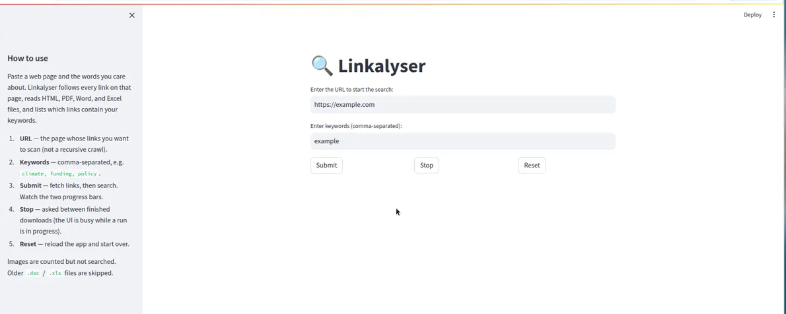

# Linkalyser

Linkalyser is a **Streamlit web app**. You use it in the browser: paste a page URL, type some keywords, and click Submit. It follows the links on that page, reads the linked HTML, PDFs, Word, and Excel files, and tells you which ones contain your keywords.

You do not need Git, Python, or this repository to *use* the tool if someone has already started the app. Open the Streamlit page, fill in the two fields, and run it.



This GitHub repo is the **source code** for that app. It helps when you want to:

- understand what the app will and will not search
- run the same app on your own machine
- open it in GitHub Codespaces (no local Python install)
- host your own copy on [Streamlit Community Cloud](https://share.streamlit.io)

## Using the app

The Streamlit sidebar repeats these steps.

1. Enter the **starting URL** (the page whose outgoing links you want to scan).
2. Enter **keywords**, separated by commas (for example: `climate, funding, policy`).
3. Click **Submit**.
4. Wait through two progress bars: first the downloads, then the keyword search.
5. Read the file-type counts and the list of matching URLs (PDF hits include page numbers).

| Button | What it does |
| ------ | ------------ |
| Submit | Start. Both URL and keywords are required. |
| Stop | Stop after the download that is currently finishing. |
| Reset | Reload the app. |

It only looks at links **on the starting page**. It does not crawl the rest of the site.

## What it can read

| Content type | What you get |
| ------------ | ------------ |
| HTML | Visible text on the linked page |
| PDF | Text per page, with page numbers in the results |
| Word (`.docx`) | Paragraph text |
| Excel (`.xlsx`) | Cell values from every sheet |
| Images | Counted only — no OCR |
| Other / failed fetches | Counted as Other, not searched |

Detection uses the HTTP `Content-Type` header, not the file name.

**Also skipped:** `mailto:` links, JavaScript-only links, login walls, older `.doc` / `.xls` files, and sites that block automated requests.

## Run your own copy

Use this when you want a private instance, or you are the person hosting the Streamlit app.

**Python 3.11+** and a network connection are required (the app fetches live URLs).

```bash
git clone https://github.com/RajeshTharyan/linkalyser.git
cd linkalyser
python3 -m venv .venv
source .venv/bin/activate   # On Windows: .venv\Scripts\activate
pip install -r requirements.txt
streamlit run linkalyser_streamlit.py
```

Then open [http://localhost:8501](http://localhost:8501).

### GitHub Codespaces

This repo includes a [Dev Container](.devcontainer/devcontainer.json). Open the repo in Codespaces (or VS Code Dev Containers) and Streamlit starts on port **8501** with the preview pane forwarded.

### Streamlit Community Cloud

1. Point a new app at this GitHub repo and `linkalyser_streamlit.py`.
2. `runtime.txt` and `requirements.txt` are picked up automatically.

## How a search works

```
Start URL
    │
    ▼
Fetch page  ──►  Collect <a href> links  (skip mailto:)
    │
    ▼
Async fetch (aiohttp, 10 concurrent, 30s timeout)
    │
    ├── HTML  → BeautifulSoup text
    ├── PDF   → PyPDF2 (pages joined with form-feed)
    ├── Word  → python-docx
    └── Excel → openpyxl
    │
    ▼
Case-insensitive keyword search
    │
    ▼
Streamlit report: counts + matching URLs
```

## Project layout

```
linkalyser/
├── linkalyser_streamlit.py   # The Streamlit app (this is what people run)
├── requirements.txt          # Python packages for that app
├── runtime.txt               # Python version for Streamlit Community Cloud
├── docs/images/              # README screenshot
└── .devcontainer/            # Codespaces: install deps and start Streamlit
```

## License

MIT — see [LICENSE](LICENSE).
